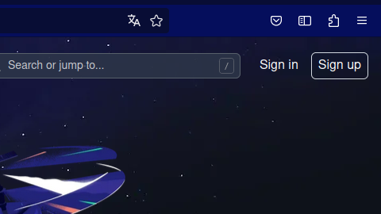
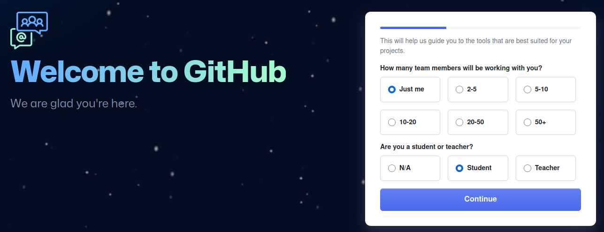
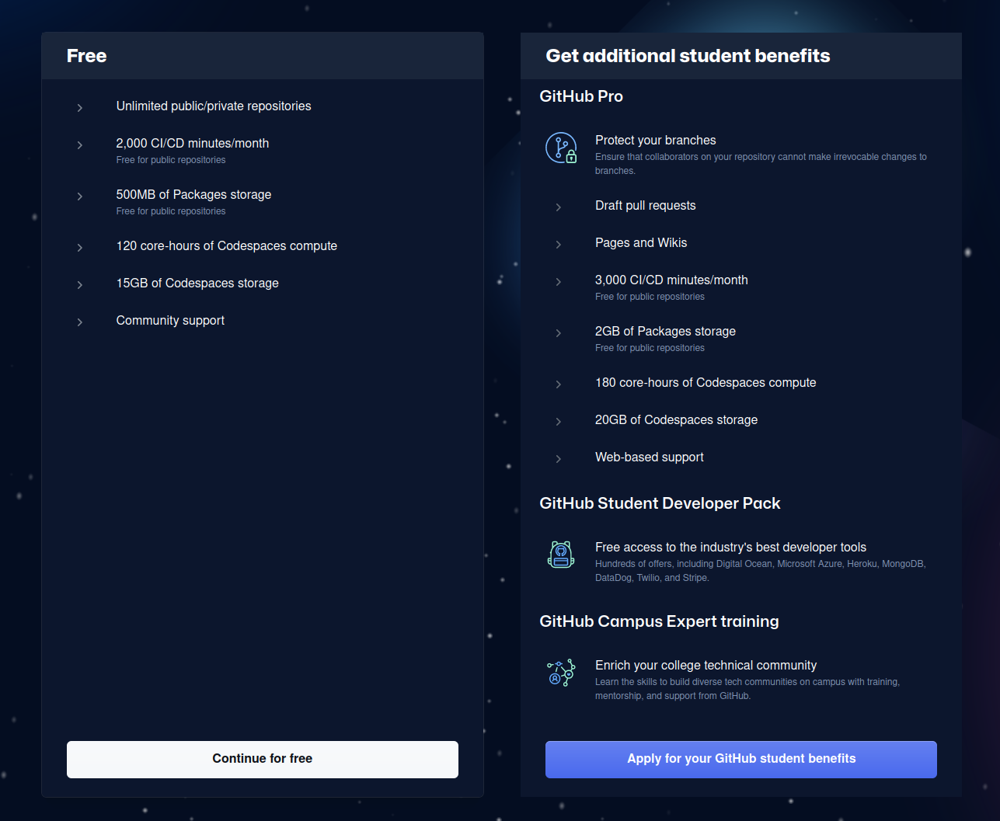

# Educafro Tech
## Curso C# - Do Básico ao MVC
---
# Agenda
1. Introdução à Programação e Ambiente de Desenvolvimento
2. Fundamentos da Programação em C#
3. Programação Orientada a Objetos (POO)
4. Desenvolvimento Web com ASP.NET MVC
5. Banco de Dados SQL Server e Entity Framework
6. Construção de um Aplicativo Web MVC
7. Implementando Recursos Avançados
8. Melhores Práticas e Testes
9. Projetos e Aplicações Futuras
---
### 1. Introdução à Programação e Ambiente de Desenvolvimento
---
### 1. Introdução à Programação e Ambiente de Desenvolvimento
#### 1.1. GitHub
##### 1.1.1. Criando sua conta
##### 1.1.2. Criando um novo projeto

---
### 1. Introdução à Programação e Ambiente de Desenvolvimento
#### 1.1. GitHub
> A plataforma de desenvolvedores baseada em IA para criar, dimensionar e fornecer software seguro.

Link: https://github.com/

---
### 1. Introdução à Programação e Ambiente de Desenvolvimento
##### 1.1.1. Criando sua conta
1. Clique em ***Sign Up*** no canto superior direito

---
##### 1.1.1. Criando sua conta

2. Será solicitado seu **e-mail** e a criação de uma **senha**.
> Se você não tiver um e-mail, você pode criar um em: https://gmail.com
3. Será solicitada a criação de um **nome de usuário**.
> Futuros contratantes verão seu nome de usuário. Sugiro utilizar algo similar ao seu nome. Ex.: rafa-silva-dev, devmariasouza, anasilva-dev
4. Se você quer notícias sobre o github por e-mail responda ***y*** para **sim**, ou ***n*** para **não**.

---
##### 1.1.1. Criando sua conta

5. Ao final, você terá que resolver um desafio para confirmar que você é um usuário e não uma máquina. Ex.:

---

##### 1.1.1. Criando sua conta

6. Clique em **Create account** para criar sua conta.
7. Um código com 8 números vai ser enviado para seu **e-mail**. Acesse seu e-mail numa nova aba ou janela e digite nessa tela o **código enviado por e-mail**.

---

##### 1.1.1. Criando sua conta

8. Agora você deve configurar sua conta.
Recomendo que você selecione:
* ***Just me*** (apenas eu)
* ***Student*** (estudante)

---

##### 1.1.1. Criando sua conta

9. Selecione quais recursos pretende utilizar. Recomendo selecionar somente **'Collaborative coding'** e, no final da página, selecione **Continue**. 

---

##### 1.1.1. Criando sua conta

10. Finalmente, serão oferecidos os tipos de conta que você deseja. Selecione ***Free*** (Grátis) e no final da página clique em **Continue for free**.

---

##### 1.1.1. Criando sua conta

#### Parabéns! 👏
Agora você possui uma conta na maior plataforma de desenvolvimento do mundo!

---
### 1. Introdução à Programação e Ambiente de Desenvolvimento
#### 1.2. Visual Studio Code
#### 1.2.1. Instalação
#### 1.2.2. Criando um novo projeto

---
### 1. Introdução à Programação e Ambiente de Desenvolvimento
#### 1.2. Visual Studio Code
> Edição de código. Redefinido. Grátis. Construído em open source. Roda em qualquer lugar.

Link: https://code.visualstudio.com/

---

##### 1.2.1 Instalação
1. Selecione a versão desejada. Se o seu computador for 32 ou 64 bits e para qual Sistema Operacional você deseja. (Windows, Linux, MacOS...)
> No meu caso estou usando o Linux Ubuntu 22.04 64bits

---

##### 1.2.1 Instalação
2. Clique duas vezes no arquivo baixado e siga as instruções para instalação.

3. **Pronto**, você tem uma das ferramentas mais populares de programação, disponível para utilização.

---

##### 1.2.2 Configuração
1. No lado esquerdo do Visual Studio Code você vê as 

---