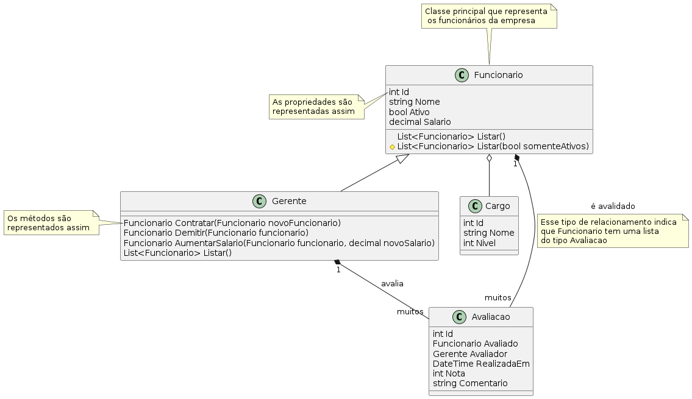

<style>
section {
    justify-content: start;
}

img[alt$="<"] {
    float: left;
    margin-right: 2em;
    }

img[alt$="center"] {
    display: block;
    margin: 0 auto;
    }
</style>

<style scoped>section { justify-content: center; }</style>

# Educafro Tech
## Curso C# - Do Básico ao MVC
### Aula 10
---
# Agenda
1. Introdução à Programação e Ambiente de Desenvolvimento
2. Fundamentos da Programação em C#
3. Programação Orientada a Objetos (POO)
4. **Desenvolvimento Web com ASP.NET MVC**
5. Banco de Dados e Entity Framework
6. Construção de um Aplicativo Web MVC
7. Implementando Recursos Avançados
8. Melhores Práticas e Testes
9. Projetos e Aplicações Futuras

---
<style scoped>section { justify-content: center; }</style>

### 4. Desenvolvimento Web com ASP.NET MVC
#### Construindo nosso projeto

---

#### Criando nossa Model

É hora de começarmos a construí-lo como a ***Model*** da nossa aplicação MVC.



---

#### Criando nossa Model

Vamos começar a construir nosso projeto criando a classe ```Cargo```.

Ela deve ser criada na pasta **Models** do nosso projeto MVC.

Ela deve ser assim:

```csharp
namespace abantu.mvc.Models
{
    public class Cargo
    {
        public int Id { get; set; }
        public string Nome { get; set; }
        public int Nivel { get; set; }
    }
}
```

---

#### Criando nossa Model

Agora, crie a classe ```Avaliacao```.

---

#### Criando nossa Model

Lembra das regras do nosso sistema?

> 3. Avaliações: Funcionário avaliado, gerente avaliador, data da avaliação, nota (1 a 10) e comentário do avaliador

Para garantir que a nota esteja nessa escala, vamos usar um novo recurso: Atributos de propriedades.

Sua propriedade ```Nota``` deve estar como essa:

```csharp
public int Nota { get; set; }
```

---

#### Criando nossa Model

Nela, vamos incluir o atributo ```Range```. O atributo ```Range```, recebe três parâmetros. Limite inferior, limite superior e a mensagem de erro quando o valor informado foi maior ou menor que os limites.

No nosso caso fica assim:

```csharp
[Range(1, 10, ErrorMessage = "A nota deve ser entre 1 e 10")]
public int Nota { get; set; }
```

---

#### Criando nossa Model

Agora, crie a classe ```Funcionario```.

Importante: 
1. Por enquanto, nos métodos, vamos colocar apenas a função: ```throw new NotImplementedException();```.

---

#### Criando nossa Model

Ao final, sua classe ```Funcionario``` deve ter ficar assim:

<font size="5">

```csharp
namespace abantu.mvc.Models
{
    public class Funcionario
    {
        public int Id { get; set; }
        public string Nome { get; set; }
        public DateTime Demissao { get; set; }
        public decimal Salario { get; set; }

        public virtual List<Funcionario> Listar(){
            throw new NotImplementedException();
        }

        protected List<Funcionario> Listar(bool ativos){
            throw new NotImplementedException();
        }
    }
}
```
</font>

---

#### Criando nossa Model

Mas lembre-se que ```Funcionario``` possui 2 associações.

Todo ```Funcionario``` tem 1 cargo e 0 ou mais avaliações.

Para isso, vamos adicionar 2 propriedades conforme abaixo:

```csharp
/// Todo funcionário tem apenas um cargo
public Cargo Cargo { get; set; }
/// Um funcionário pode ter várias avaliações
public List<Avaliacao> Avaliacoes { get; set; }
```

---

#### Criando nossa Model

Por fim, vamos crie a classe ```Gerente``` que herda de ```Funcionario``` suas propriedades e métodos. Para isso vamos usar ```: Funcionario``` após o nome da classe.

Observe também que ela tem um método público ```Listar``` idêntico ao da classe funcionário.

Ou seja, na classe ```Funcionario```, ```Listar``` deve estar marcado com ```virtual``` e na classe ```Gerente``` o método deve estar marcado com ```override```.

---

#### Criando nossa Model

Sua classe ```Gerente``` deve ter ficado assim:

<font size="4">

```csharp
namespace abantu.mvc.Models;

public class Gerente : Funcionario
{
    public Funcionario Contratar(Funcionario novoFuncionario) {
        throw new NotImplementedException();
    }

    public Funcionario Demitir(Funcionario funcionario) {
        throw new NotImplementedException();
    }

    public Funcionario AumentarSalario(Funcionario funcionario, decimal novoSalario) {
        throw new NotImplementedException();
    }

    public override List<Funcionario> Listar() {
        throw new NotImplementedException();
    }
}
```

</font>

---

<style scoped>section { justify-content: center; }</style>

# Muito obrigado
## E nos vemos na próxima aula! 👋


