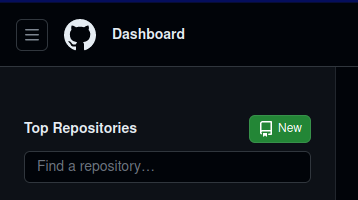
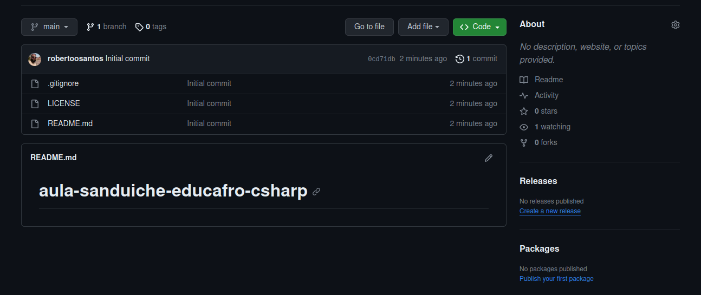
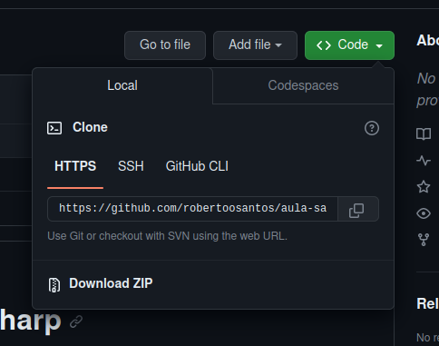

<style>
section {
    justify-content: start;
}

img[alt$="<"] {
    float: left;
    margin-right: 2em;
    }

img[alt$="center"] {
    display: block;
    margin: 0 auto;
    }
</style>

<style scoped>section { justify-content: center; }</style>

# Educafro Tech
## Curso C# - Do Básico ao MVC
### Aula 3
---
# Agenda
1. Introdução à Programação e Ambiente de Desenvolvimento
2. **Fundamentos da Programação em C#**
3. Programação Orientada a Objetos (POO)
4. Desenvolvimento Web com ASP.NET MVC
5. Banco de Dados SQL Server e Entity Framework
6. Construção de um Aplicativo Web MVC
7. Implementando Recursos Avançados
8. Melhores Práticas e Testes
9. Projetos e Aplicações Futuras

---
<style scoped>section { justify-content: center; }</style>

### 1. Introdução à Programação e Ambiente de Desenvolvimento
#### Criando uma aplicação .Net em C#

---

#### Criando um novo repositório

Agora que temos tudo pronto, vamos começar no GitHub.

Acesse: https://github.com com seu usuário e senha.

No lado esquerdo, clique em **New**, para criar um novo repositório.



---

#### Criando um novo repositório

Agora escolha um nome para o repositório.


No meu caso eu escolhi: ```aula-sanduiche-educafro-csharp```

---

#### Criando um novo repositório

Existem duas opções para um repositório:

***Public*** (ou público, em português) significa que qualquer pessoa com acesso a internet terá acesso aos seus códigos

***Private*** (ou privado, em português) você pode definir quem terá acesso aos seus códigos

Para o conteúdo da nossa aula, utilizaremos sempre a opção ***Public***.


---

#### Criando um novo repositório

Selecione a opção:

***Add a README file*** (do inglês *read me file*. Ou seja, arquivo Leia-me) Todo programa de computador é um exercício de criatividade. ⚠️ Sempre faça algum tipo de documentação ⚠️ 


---

#### Criando um novo repositório

Selecione a opção:

**Visual Studio** em ***Add .gitignore***


Por trás do **Git**Hub existe uma tecnologia que se chama Git. Ela tem a função de controlar as mudanças que são feitas nos programas de um repositório.

Mas alguns arquivos não precisam desse controle. O nome desses arquivos colocamos no arquivo **.gitignore**

---

#### Criando um novo repositório

Por último, selecione:

**GNU General Public License v3.0** em ***Choose a license***


Existe um mundo de conhecimento relacionado a licenças de software, mas basicamente a GPLv3 dá liberdade, mas também algum controle.

---

#### Criando um novo repositório

##### 🎈🎈🎈PARABÉNS!🎈🎈🎈 Você criou seu primeiro repositório de código C#!




---

#### Criando um novo repositório

Agora que você tem um repositório criado, vamos começar a desenvolver nossa primeira aplicação em C#.

Até agora, tudo que você fez está apenas na internet. Vamos começar copiando este repositório para o seu computador.


---

#### Clonando um repositório

No canto superior direito clique em **<> Code**



Copie o endereço HTTPS do seu repositório clicando em: 


---

#### Clonando um repositório

Abra o Visual Studio Code.

Do lado esquerdo, toque em 


---

#### Clonando um repositório

Clique no botão ***Clone Repository***


Clique em ***Clone from GitHub***


Clique no repositório que você criou no começo dessa aula


---

#### Clonando um repositório

Agora, escolha uma pasta do seu computador para o seu repositório.

> Eu sugiro, Documentos/Projetos

O Visual Studio Code irá perguntar se você quer abrir o repositório.

Escolha ***Open*** ou ***Abrir***.

---


#### Criando uma Console Application

A base de todo programa C# é um projeto.

Para criar um projeto, no Visual Studio Code clique em **Terminal** > **New Terminal** ou **Novo Terminal**.


---

#### Criando uma Console Application

No terminal, digite ```dotnet```

```console
$ dotnet

Usage: dotnet [options]
Usage: dotnet [path-to-application]

Options:
  -h|--help         Display help.
  --info            Display .NET information.
  --list-sdks       Display the installed SDKs.
  --list-runtimes   Display the installed runtimes.

path-to-application:
  The path to an application .dll file to execute.
```

---

#### Criando uma Console Application

Note a opção ```-h|--help```. Essa opção mostra uma ajuda do comando ```dotnet```.

Agora vamos experimentar ```dotnet -h``` ou ```dotnet --help```

Escreva uma das opções no terminal e tecle **Enter**

Veja que a primeira opção é:

```new               Create a new .NET project or file.```

Ou seja, digitar ```dotnet new``` vai criar um novo projeto .Net no seu repositório

---

#### Criando uma Solução

Veja que ao digitar ```dotnet new``` e apertar a tecla **Enter** são exibidas mais algumas informações:

```
The 'dotnet new' command creates a .NET project based on a template.

Common templates are:
Template Name         Short Name    Language    Tags               
--------------------  ------------  ----------  -------------------
ASP.NET Core Web App  webapp,razor  [C#]        Web/MVC/Razor Pages
Blazor Server App     blazorserver  [C#]        Web/Blazor         
Class Library         classlib      [C#],F#,VB  Common/Library     
Console App           console       [C#],F#,VB  Common/Console     

An example would be:
   dotnet new console
```

---

#### Criando uma Solução

Esses são alguns exemplos de projetos que você pode fazer em .Net.

Vamos usar o ```dotnet new solution``` para criar uma solução .Net.

Veja que foi criado 1 arquivos no seu repositório. No lado esquerdo clique em: 

E veja os arquivos marcados com **U**


---

#### Criando uma Console Application

De volta ao terminal, vamos usar o ```dotnet new console -o Sanduiche``` uma das opções mais simples de projeto em .Net com a linguagem C#.

Veja que foram criados uma pasta com o nome Sanduiche e 2 arquivos no seu repositório.


---

#### Criando uma Console Application

O arquivo que termina com ```.csproj``` é o arquivo do **proj**eto **C** **S**harp

O arquivo ```Program.cs``` é o programa base do projeto. Clique duas vezes nele.

Ele é um arquivo bastante simples com apenas uma função C#.

```
Console.WriteLine("Hello, World!");
```

*Hello, World!* significa Olá, Mundo!

Para entender o que esse programa faz, vamos experimentar executá-lo.

---

#### Executando um programa C#

Vamos adicionar o projeto na solução, execute, no terminal, o comando ```dotnet sln add ./Sanduiche/Sanduiche.csproj``` e tecle **Enter**

Depois, digite ```dotnet run --project ./Sanduiche``` e tecle **Enter**

```
dotnet run --project ./Sanduiche

Hello, World!

```

Ou seja, o ```Console.Writeline``` é uma função para mostrar na tela a mensagem que você quiser.

---

#### Vamos fazer um sanduíche!

Agora vamos experimentar fazer o exercício de fazer um sanduíche de mortadela com requeijão!


---


